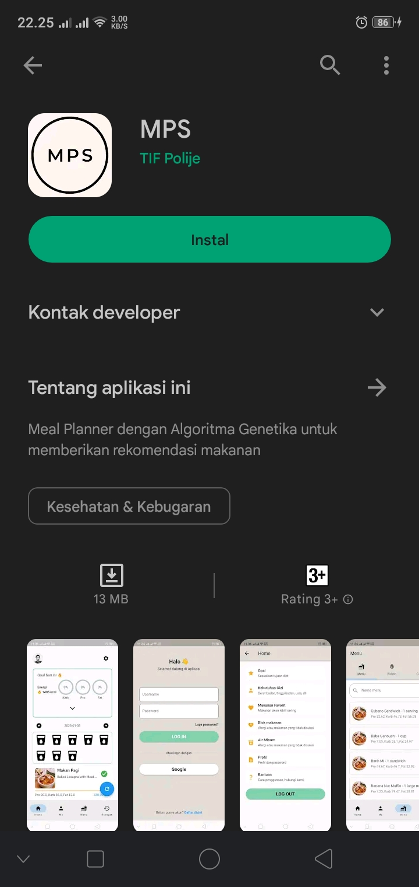

# Selamat datang di Meal Planner on Steroid

Meal Planner on Steroid atau MPS merupakan aplikasi yang membuat rekomendasi rencana diet secara otomatis dengan menggunakan ✨ **Algoritma Genetika** ✨ yang didasarkan dengan ✨ **Kebutuhan Gizi** ✨ yang anda miliki.

Tidak perlu hal rumit untuk membuat rencana diet, dengan satu tombol, kami akan memberikan rencana diet yang sesuai untuk anda.

---

## Install Aplikasi

Untuk memulai menggunakan MPS, anda perlu mengunduh aplikasi kami pada [!button variant="light" text="Play Store"](https://play.google.com/store/apps/details?id=io.github.alifirhas.mps)

Klik tombol [!button variant="success" text="Install"] dan tunggu proses instalasi dari Play Store selesai, kemudian klik [!button variant="success" text="Buka"]

---

## Quick Start

### Login

### Isi data diri

### Home page

### Buat rekomendasi makanan

### Lihat hasil

---

## Selebihnya

Untuk dokumentasi selengkapnya dari MPS, anda bisa mengunjungi [Dokumentasi Halaman](mobile/Halaman/readme.md) dan [Dokumentasi Fitur](mobile/Fitur/readme.md). Selamat menggunakan 😊.
