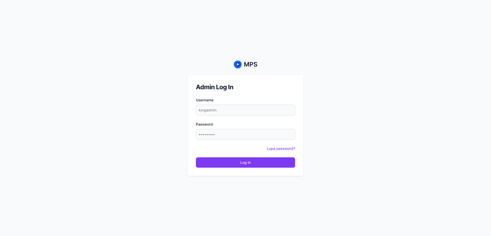
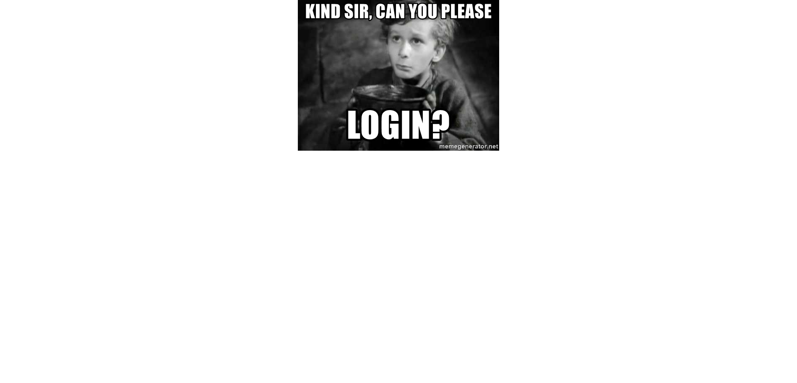
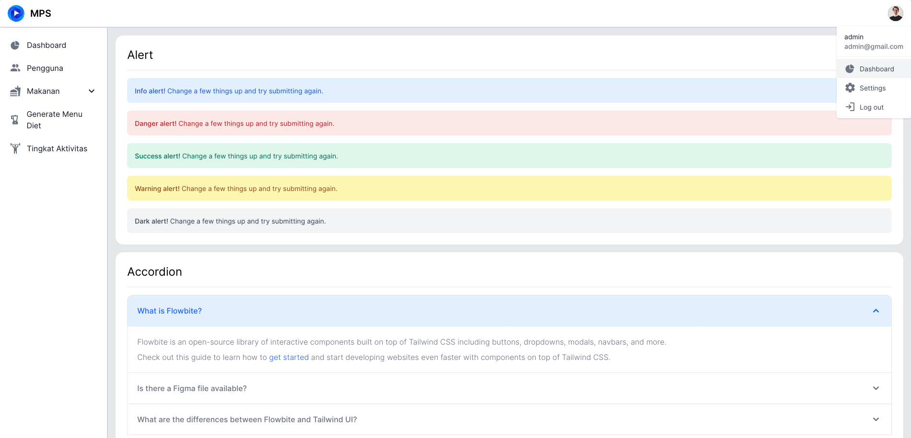

# Auth

## Login

Sebelum anda masuk ke halaman admin, anda perlu melakukan login terlebih dahulu. Untuk melakukan login anda perlu mengisi 

1. Username
2. Password

Setelah anda menekan tombol [!badge Log in], anda akan diarahkan ke Halaman Dashboard. 

Jika sesi anda berakhir atau anda melakukan login ketika mengakses halaman admin-panel lainnya anda akan ditampilkan [Login Error](readme.md#login-error).

### Login error

Jika ada ditampilkan halaman ini, hanya ada perlu menekan klik kiri pada mouse dan anda akan diarahkan kembali ke [Halaman Login](readme.md#login).

## Logout

Untuk logout anda bisa menekan icon atau tombol avatar, kemudian menekan tombol logout.

