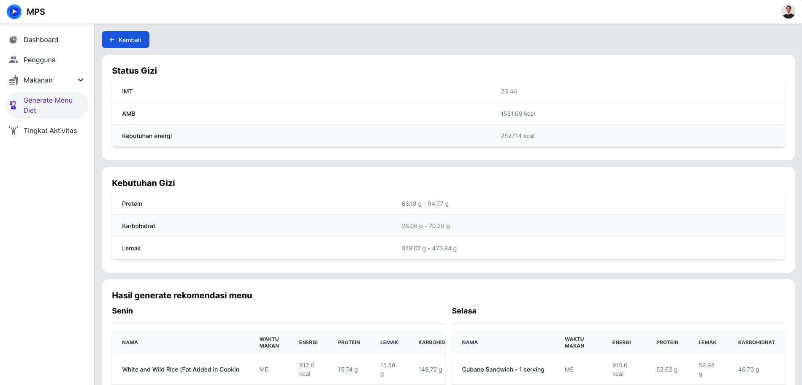

# Generate Rencana Diet

Untuk mengakses halaman ini, anda perlu melakukan [Login](../auth/readme.md#login) dan menekan tab [!badge Generate Menu Diet] pada sidebar di sebelah kanan.

Untuk menjalankan test pembuatan diet anda perlu mengisi simulasi data pengguna, yaitu:

1. Berat badan
2. Tinggi badan
3. Usia
4. Gender
5. Tingkat Aktivitas

Kemudian tekan tombol [!badge Buat Rekomendasi Menu makanan], setelah itu perlu menunggu beberapa saat untuk melihat hasil.

Setelah proses selesai, anda akan dialihkan ke halaman hasil

## Hasil Rekomendasi

Di halaman ini terdapat 3 jenis element, yaitu:

1. Status Gizi
   1. Status gizi
   2. Kebutuhan gizi
2. Hasil generate rekomendasi menu
3. Detail proses algoritma genetika

### Status gizi

Status gizi terdiri dari

1. IMT
2. AMB
3. Kebutuhan energi
4. Kebutuhan protein
5. Kebutuhan karbohidrat
6. Kebutuhan lemak

### Hasil generate rekomendasi menu

Hasil rekomendasi ini terdiri dari 7 set makanan yang terdiri dari 3 menu makanan dan dua camilan untuk 7 hari diet.

### Detail proses generasi

Karena proses algoritma genetika yang memerlukan banyak generasi. Detail proses generasi hanya ditampilkan 3 generasi, yaitu

1. Generasi awal
2. Generasi tengah
3. Generasi akhir

Pada setiap generasi terdapat detail

1. Rekomendasi
2. Nilai fitness gizi
   1. Nilai gizi
   2. Nilai fitness
   3. Rata-rata nilai fitness
3. Generasi mutasi
4. Generasi elit
