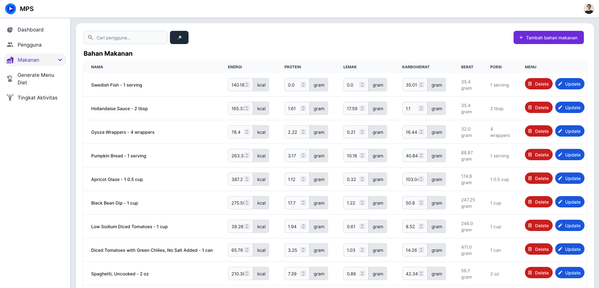
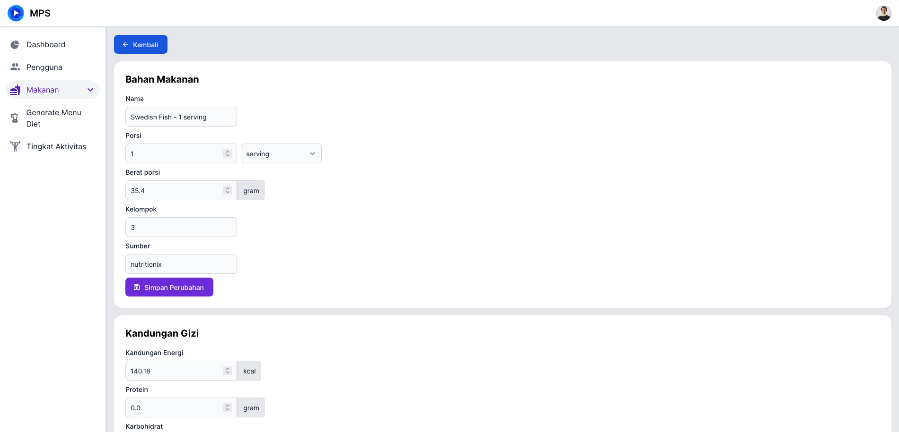
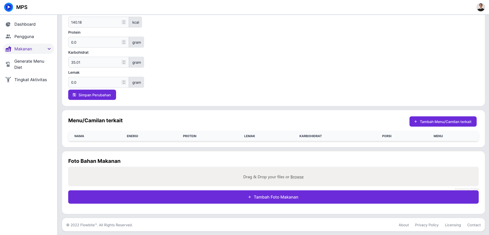
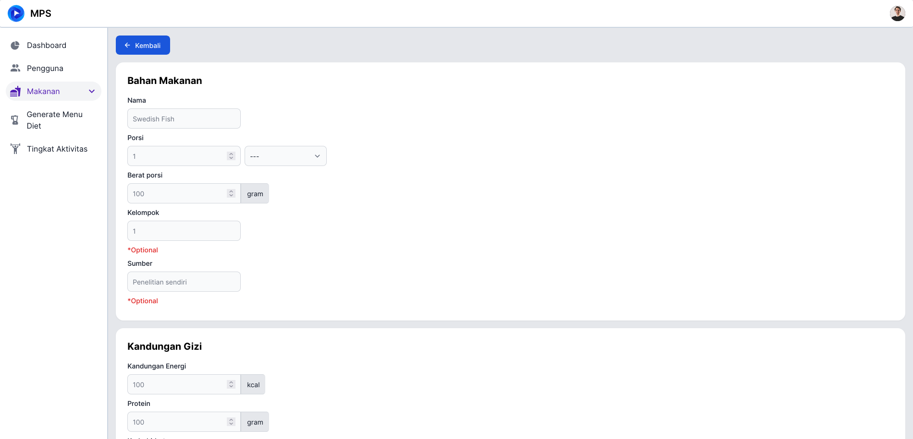
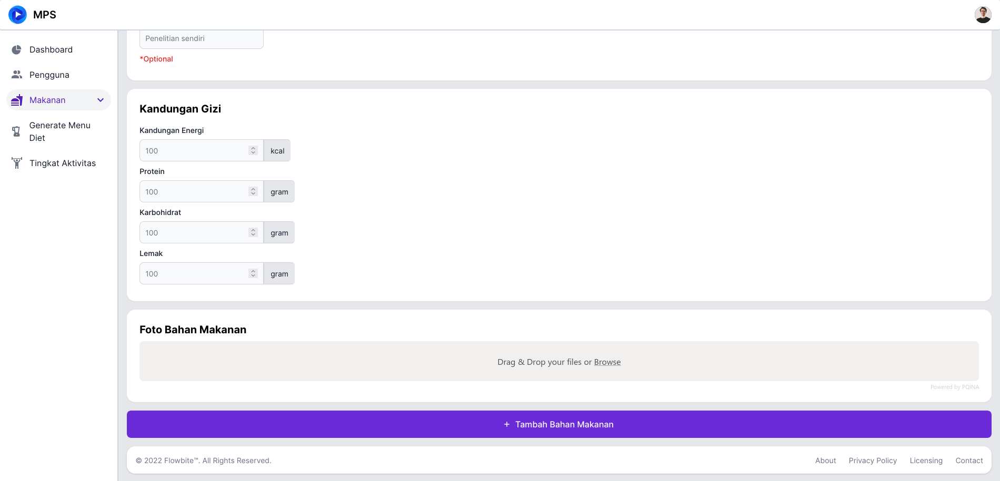

# Bahan Makanan

Untuk mengakses halaman ini, anda perlu melakukan [Login](../auth/readme.md#login) dan menekan tab [!badge Bahan Makanan] pada sidebar di sebelah kanan.

## Detail Bahan Makanan

Untuk melihat detail dari salah satu bahan makanan, anda bisa menekan nama dari bahan makanan yang anda mau lihat. Kemudian anda akan diarahkan ke halaman detail bahan makanan.

Disini terdapat:

1. Detail bahan makanan general
2. Kandungan gizi
3. Menu/Camilan terkait
4. Foto

!!!
Terdapat banyak ketidak lengkapan data pada makanan terkait dan foto karena waktu pengerjaan
!!!
!!!
Saat ini terdapat masalah pada upload foto pada server
!!!

## Tambah Bahan Makanan

Tekan [!badge tambah bahan bahan makanan] pada [halaman dashboard bahan makanan](bahan_makanan.md#bahan-makanan), kemudian anda akan dialihkan ke halaman untuk menambah bahan makanan

Disini anda akan mengisi

1. Nama
2. Porsi
3. Berat porsi
4. Kelompok (optional)
5. Sumber (optional)
6. Kandungan gizi
   1. Energi
   2. Protein
   3. Karbohidrat
   4. Lemak
7. Foto bahan makanan

!!!
Saat ini terdapat masalah pada upload foto pada server
!!!

## Edit Bahan Makanan

Anda bisa melakukan edit data bahan makanan pada [Dashboard Bahan Makanan](bahan_makanan.md#bahan-makanan) atau pada [Halaman Detail Bahan Makanan](bahan_makanan.md#detail-bahan-makanan).

Pada halaman detail anda bisa mengatur:

1. Nama
2. Porsi
3. Berat porsi
4. Kelompok (optional)
5. Sumber (optional)
6. Kandungan gizi
   1. Energi
   2. Protein
   3. Karbohidrat
   4. Lemak
7. Foto bahan makanan
8. Menu/Camilan terkait

Pada halaman dashboard anda bisa mengatur:

1. Kandungan gizi
   1. Energi
   2. Protein
   3. Karbohidrat
   4. Lemak
