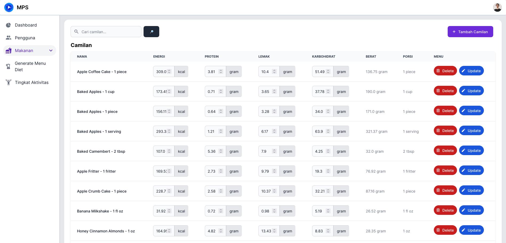
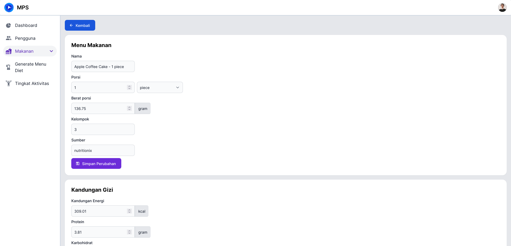
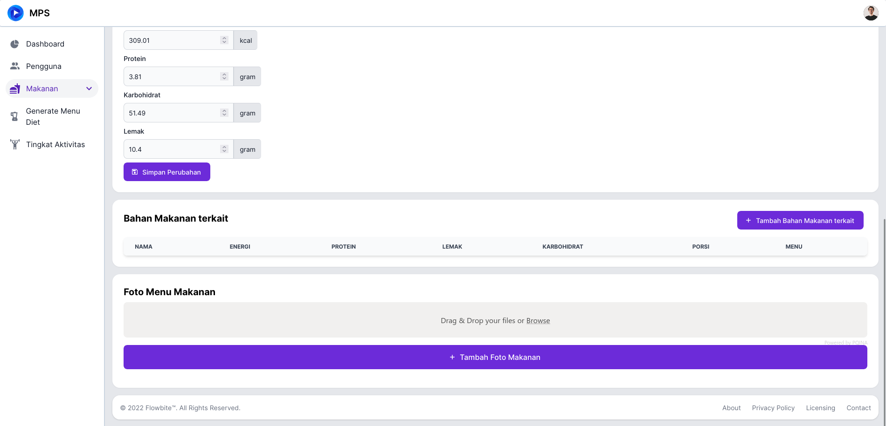
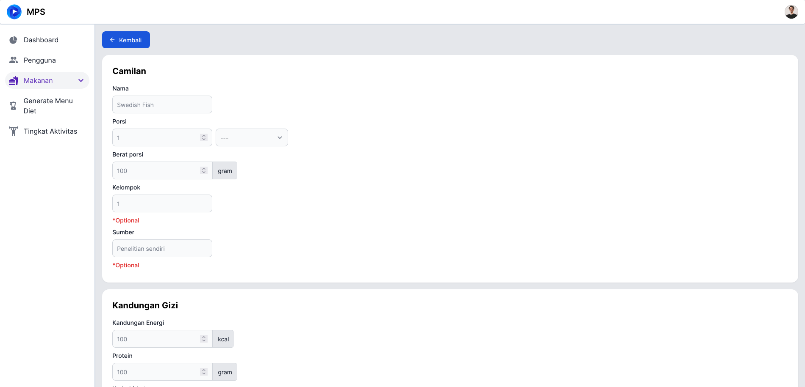
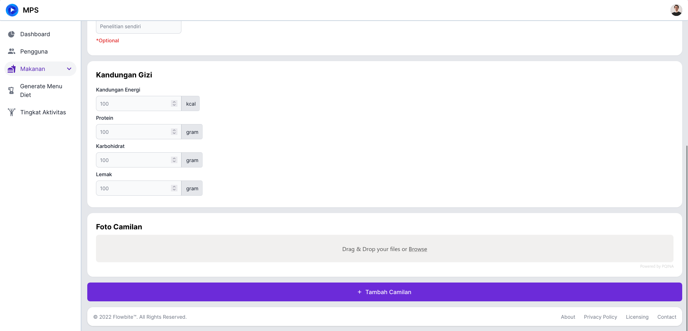

# Camilan

Untuk mengakses halaman ini, anda perlu melakukan [Login](../auth/readme.md#login) dan menekan tab [!badge Camilan] pada sidebar di sebelah kanan.

## Detail Camilan

Untuk melihat detail dari salah satu camilan, anda bisa menekan nama dari camilan yang anda mau lihat. Kemudian anda akan diarahkan ke halaman detail camilan.

Disini terdapat:

1. Detail camilan general
2. Kandungan gizi
3. Bahan makanan terkait
4. Foto

!!!
Terdapat banyak ketidak lengkapan data pada makanan terkait dan foto karena waktu pengerjaan
!!!
!!!
Saat ini terdapat masalah pada upload foto pada server
!!!

## Tambah Camilan

Tekan [!badge tambah camilan] pada [halaman dashboard camilan](camilan.md#camilan), kemudian anda akan dialihkan ke halaman untuk menambah camilan

Disini anda akan mengisi

1. Nama
2. Porsi
3. Berat porsi
4. Kelompok (optional)
5. Sumber (optional)
6. Kandungan gizi
   1. Energi
   2. Protein
   3. Karbohidrat
   4. Lemak
7. Foto camilan

!!!
Saat ini terdapat masalah pada upload foto pada server
!!!

## Edit Camilan

Anda bisa melakukan edit data camilan pada [Dashboard Camilan](camilan.md#camilan) atau pada [Halaman Detail Camilan](camilan.md#detail-camilan).

Pada halaman detail anda bisa mengatur:

1. Nama
2. Porsi
3. Berat porsi
4. Kelompok (optional)
5. Sumber (optional)
6. Kandungan gizi
   1. Energi
   2. Protein
   3. Karbohidrat
   4. Lemak
7. Foto camilan
8. Bahan makanan terkait

Pada halaman dashboard anda bisa mengatur:

1. Kandungan gizi
   1. Energi
   2. Protein
   3. Karbohidrat
   4. Lemak
