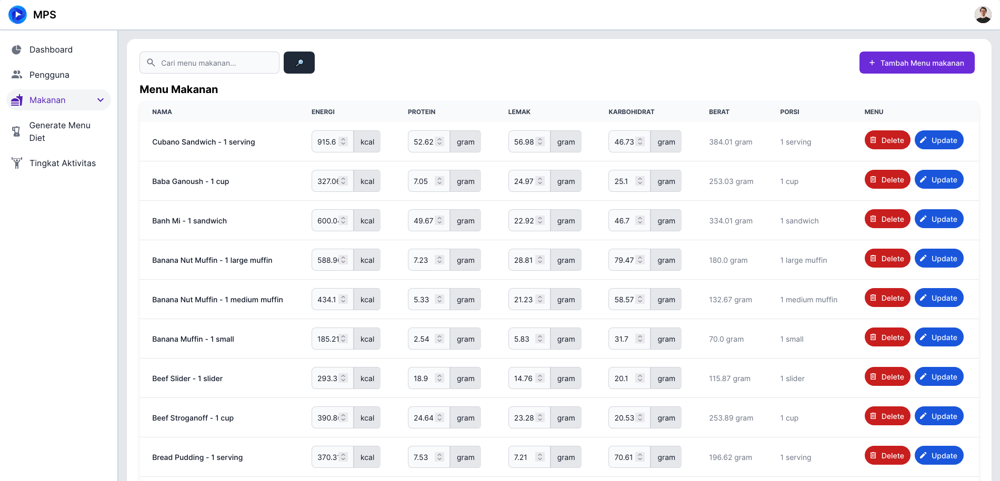
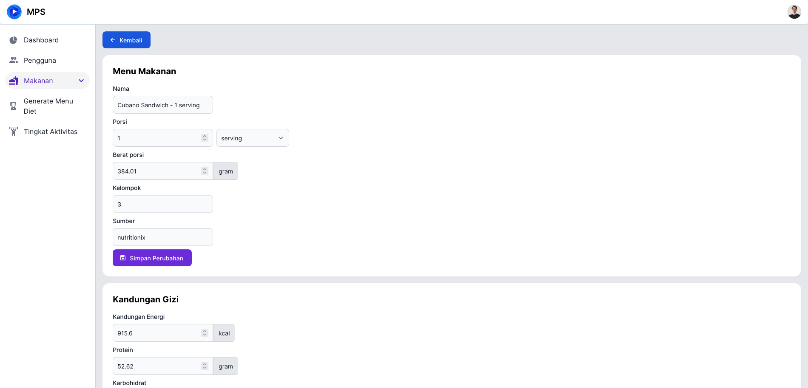
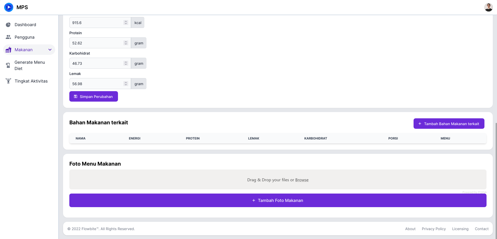
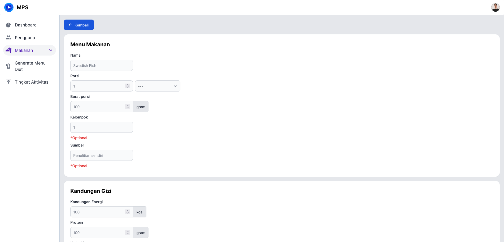
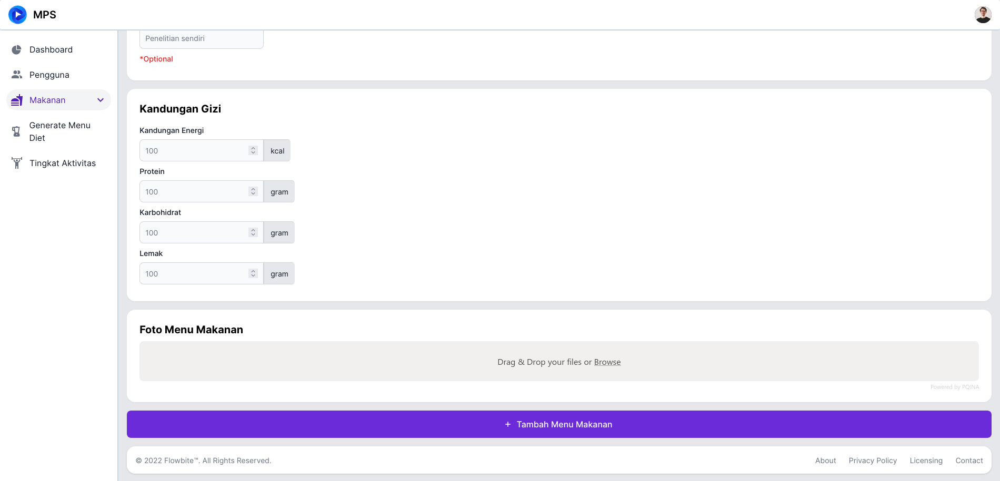

# Menu Makanan

Untuk mengakses halaman ini, anda perlu melakukan [Login](../auth/readme.md#login) dan menekan tab [!badge Menu Makanan] pada sidebar di sebelah kanan.

## Detail Menu Makanan

Untuk melihat detail dari salah satu menu makanan, anda bisa menekan nama dari menu makanan yang anda mau lihat. Kemudian anda akan diarahkan ke halaman detail menu makanan.

Disini terdapat:

1. Detail menu makanan general
2. Kandungan gizi
3. Bahan makanan terkait
4. Foto

!!!
Terdapat banyak ketidak lengkapan data pada makanan terkait dan foto karena waktu pengerjaan
!!!
!!!
Saat ini terdapat masalah pada upload foto pada server
!!!

## Tambah Menu Makanan

Tekan [!badge tambah menu makanan] pada [halaman dashboard menu makanan](menu_makanan.md#menu-makanan), kemudian anda akan dialihkan ke halaman untuk menambah menu makanan

Disini anda akan mengisi

1. Nama
2. Porsi
3. Berat porsi
4. Kelompok (optional)
5. Sumber (optional)
6. Kandungan gizi
   1. Energi
   2. Protein
   3. Karbohidrat
   4. Lemak
7. Foto menu makanan

!!!
Saat ini terdapat masalah pada upload foto pada server
!!!

## Edit menu Makanan

Anda bisa melakukan edit data menu makanan pada [Dashboard Menu Makanan](menu_makanan.md#menu-makanan) atau pada [Halaman Detail menu Makanan](menu_makanan.md#detail-menu-makanan).

Pada halaman detail anda bisa mengatur:

1. Nama
2. Porsi
3. Berat porsi
4. Kelompok (optional)
5. Sumber (optional)
6. Kandungan gizi
   1. Energi
   2. Protein
   3. Karbohidrat
   4. Lemak
7. Foto menu makanan
8. Bahan makanan terkait

Pada halaman dashboard anda bisa mengatur:

1. Kandungan gizi
   1. Energi
   2. Protein
   3. Karbohidrat
   4. Lemak
