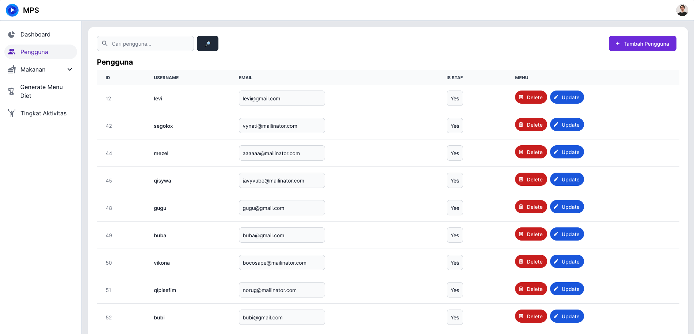
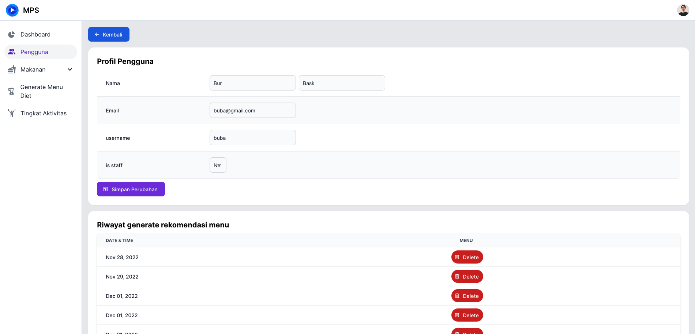
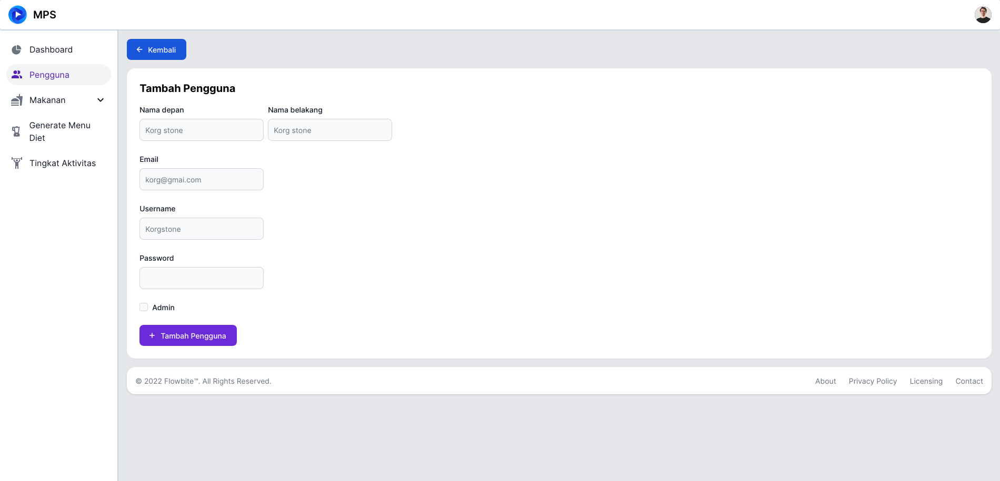

# Pengguna

Untuk mengakses halaman ini, anda perlu melakukan [Login](../auth/readme.md#login) dan menekan tab [!badge pengguna] pada sidebar di sebelah kanan.

## Detail Pengguna

Untuk melihat detail dari salah satu pengguna, anda bisa menekan username dari pengguna yang anda mau lihat. Kemudian anda akan diarahkan ke halaman detail pengguna.

Disini terdapat:

1. Detail akun pengguna
2. Riwayat rekomendasi rencana diet yang digunakan

Disini anda juga bisa melakukan [Edit Pengguna](readme.md#edit-pengguna)

## Tambah pengguna

Tekan [!badge tambah pengguna] pada [halaman dashboard pengguna](readme.md#pengguna), kemudian anda akan dialihkan ke halaman untuk menambah pengguna

Disini anda akan mengisi

1. Nama depan
2. Nama belakang
3. Email
4. Username
5. Password
6. Admin atau tidak

Setelah anda mengisi semuanya, anda bisa menekan tombol [!badge Tambah Pengguna].

## Edit Pengguna

Anda bisa melakukan edit data pengguna pada [Dashboard Pengguna](readme.md#pengguna) atau pada [Halaman Detail Pengguna](readme.md#detail-pengguna).

Pada halaman detail anda bisa mengatur:

1. Nama depan dan Nama belakang
2. Email
3. Username
4. dan status staff

Pada halaman dashboard anda bisa mengatur:

1. Username
2. Email
3. dan status staff
