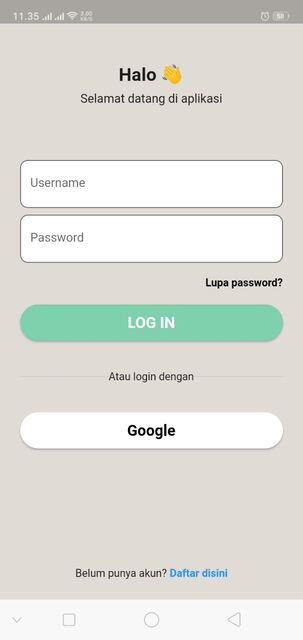
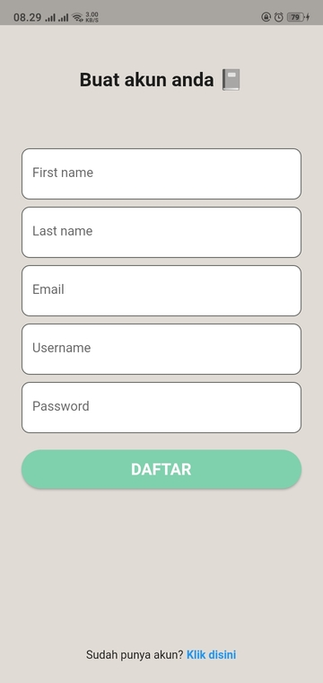

# Autentikasi

## Login

Setelah anda membuka MPS, anda akan ditampilkan sebuah login, yang anda butuhkan adalah

1. Username
2. Password

Yang telah anda daftarkan di MPS.

Jika anda belum memiliki akun, maka anda dapat mendaftar pada halaman [Register](auth.md#register) dengan [!badge Belum punya akun? Daftar disini]

---

## Register

Anda akan ditampilkan sebuah form untuk melakukan registrasi ke MPS, dalam form ini anda akan mengisi data

1. First name / Nama depan
2. Last name / Nama belakang
3. Email
4. Username
5. Password

Email akan kami gunakan nantinya untuk proses penggantian password jika anda lupa password dari akun anda. Sedangkan username akan anda gunakan untuk [Login](auth.md#login).

Setelah anda mengisi seluruh form, klik [!badge variant="success" text="DAFTAR"]

**Jika** anda telah memiliki akun, anda bisa kembali ke halaman login dengan menekan tombol kembali :icon-reply: pada smartphone anda atau menekan link [!badge Sudah punya akun? Klik disini]

---

## Logout

Untuk keluar dari aplikasi, anda bisa menuju ke halaman setting dengan menekan tombol [!badge variant="contrast" icon="gear"] pada [Halaman Home](../Halaman/home_page.md) atau halaman lainnya untuk menuju ke [Halaman Setting](../Halaman/setting_page.md)

Pada halaman setting anda bisa menekan tombol [!button variant="success" text="LOG OUT"]
