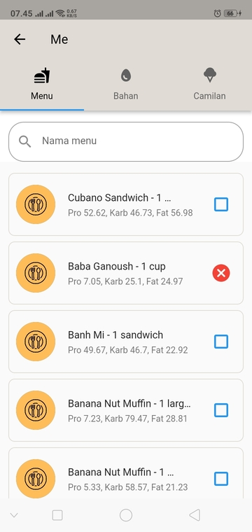

# Blok Makanan

Anda dapat mengakses halaman ini dengan menuju ke [Halaman Me](readme.md) dan menekan tombol [!badge text="💔 Blok Makanan"] pada bagian atas.

Di [Makanan Favorit](makanan_favorit_page.md) dan [Blok Makanan](blok_makanan.md) terdapat 3 tab yaitu:

1. Menu makanan
2. Bahan makanan
3. Camilan

Pada setiap tab ini anda bisa melakukan beberapa aktivitas yaitu:

## Cari blok makanan

Anda dapat mencari makanan dengan mengetik nama dari makanan yang ingin anda cari di kolom pencarian diatas. MPS akan mencari makanan yang anda cari secara otomatis selagi anda mengetik.

## Tambah blok makanan

Anda dapat menambah blok makanan dengan menekan checkbox [!badge variant="primary" icon="square"] berwarna biru, setelah anda menekan checkbox tersebut, icon akan berubah menjadi checkbox [!badge variant="danger" icon="x-circle-fill"] berwarna merah

## Hapus blok makanan

Anda dapat menghapus blok makanan dengan menekan checkbox [!badge variant="danger" icon="x-circle-fill"] berwarna merah, setelah anda menekan checkbox tersebut, icon akan berubah menjadi checkbox [!badge variant="primary" icon="square"] berwarna biru
