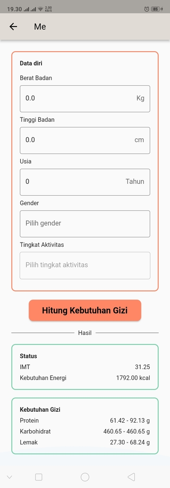
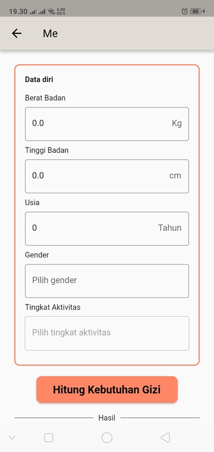
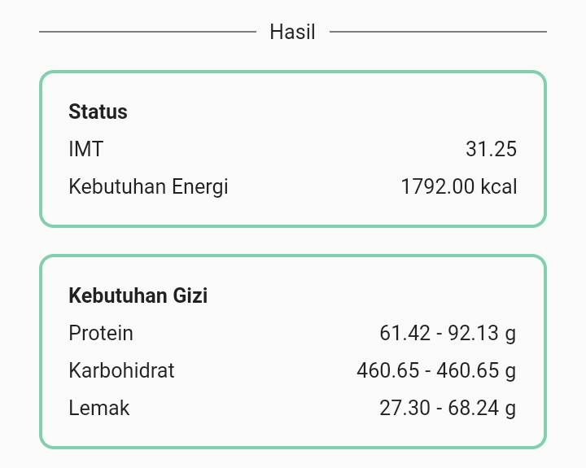

# Kebutuhan Gizi

Anda dapat mengakses halaman ini dengan menuju ke [Halaman Me](readme.md) dan menekan tombol [!badge icon="person" text="Kebutuhan Gizi"] pada bagian atas.

Dalam halaman ini terdapat beberapa element, yaitu

## Form Data Kesehatan

Setiap anda Login, MPS akan menampilkan sebuah splash screen dan pada halaman terakhir anda akan mengisi data kesehatan anda yang terbaru. Anda tidak akan bisa mengakses aplikasi sebelum anda mengisi form tersebut. Dalam form ini anda akan mengisi

1. Berat badan (kg)
2. Tinggi badan (cm)
3. Usia (tahun)
4. Gender
5. Tingkat Aktivitas

Gender dan Tingkat Aktivitas merupakan pilihan ganda. Pilihan ganda dari Gender dan Tingkat Aktivitas adalah

||| Gender

- Laki-laki
- Perempuan

|||

||| Tingkat Aktivitas

- Sangat Ringan
- Ringan
- Sedang
- Berat

|||

Setelah anda sudah mengisi seluruh bagian form, silahkan klik [!badge variant="warning" text="Hitung Kebutuhan Gizi"]. Hasil dari kebutuhan gizi akan ditampilkan di bawah form.

---

## Hasil Perhitungan Kebutuhan Gizi

Terdapat dua kotak yang menampilkan status gizi anda saat ini, status yang ditampilkan adalah

1. IMT
2. Kebutuhan Gizi anda untuk mencapai tujuan
3. Kebutuhan gizi
   1. Protein
   2. Karbohidrat
   3. Lemak
