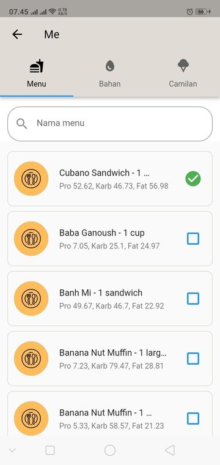

# Makanan Favorit

Anda dapat mengakses halaman ini dengan menuju ke [Halaman Me](readme.md) dan menekan tombol [!badge icon="heart" text="Makanan Favorit"] pada bagian atas.

Di [Makanan Favorit](makanan_favorit_page.md) dan [Blok Makanan](blok_makanan.md) terdapat 3 tab yaitu:

1. Menu makanan
2. Bahan makanan
3. Camilan

Pada setiap tab ini anda bisa melakukan beberapa aktivitas yaitu:

## Cari makanan favorit

Anda dapat mencari makanan dengan mengetik nama dari makanan yang ingin anda cari di kolom pencarian diatas. MPS akan mencari makanan yang anda cari secara otomatis selagi anda mengetik.

## Tambah makanan favorit

Anda dapat menambah makanan favorit dengan menekan checkbox [!badge variant="primary" icon="square"] berwarna biru, setelah anda menekan checkbox tersebut, icon akan berubah menjadi checkbox [!badge variant="success" icon="check-circle-fill"] berwarna hijau

## Hapus makanan favorit

Anda dapat menghapus makanan favorit dengan menekan checkbox [!badge variant="success" icon="check-circle-fill"]  berwarna hijau, setelah anda menekan checkbox tersebut, icon akan berubah menjadi checkbox [!badge variant="primary" icon="square"] berwarna biru
