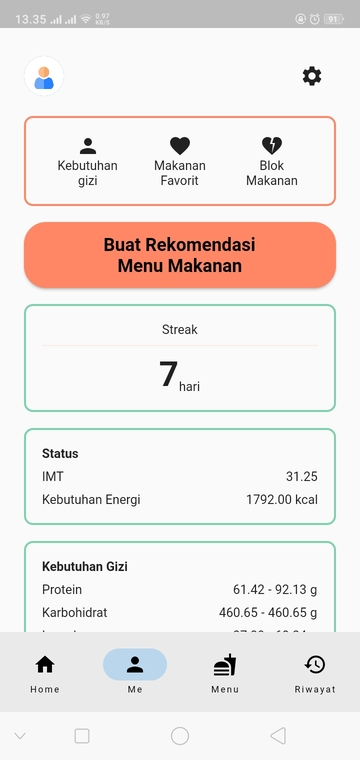

# Me

Pada halaman utama terdapat beberapa hal atau yang kami sebut element. Element ini adalah

## Kebutuhan Gizi

Dengan menekan link ini anda akan dialihkan ke [Halaman Kebutuhan Gizi](kebutuhan_gizi_page.md)

---

## Makanan Favorit

Dengan menekan link ini anda akan dialihkan ke [Halaman Makanan Favorit](makanan_favorit_page.md)

---

## Blok Makanan

Dengan menekan link ini anda akan dialihkan ke [Halaman Blok Makanan](blok_makanan.md)

---

## Buat Rekomendasi Makanan

Seperti pada penjelasan [Quick Start](../../../readme.md#quick-start), dengan menekan link tombol ini anda akan dialihkan menuju ke [Halaman Hasil Rekomendasi Menu Makanan](buat_rekomendasi_menu_makanan_page.md#hasil-rekomendasi)

---

## Status

Terdapat dua kotak yang menampilkan status gizi anda saat ini, status yang ditampilkan adalah

1. IMT
2. Kebutuhan Gizi anda untuk mencapai tujuan
3. Kebutuhan gizi
   1. Protein
   2. Karbohidrat
   3. Lemak
