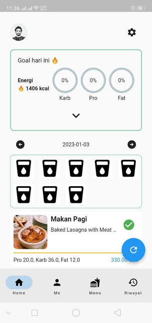
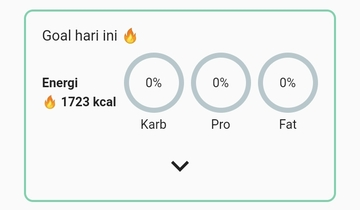
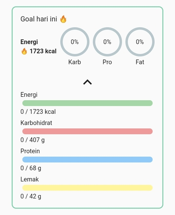
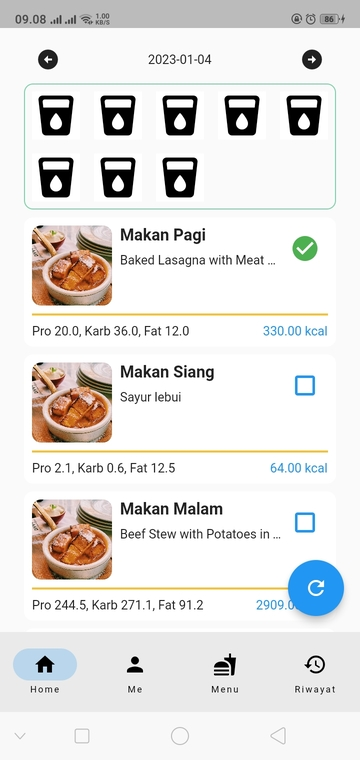

# Home Page

Pada halaman utama terdapat beberapa hal atau yang kami sebut element. Element ini adalah

## Goto Profil

Untuk menuju ke halaman profil dan melakukan perubahan seperti

1. Nama depan
2. Nama belakang
3. Password

Anda bisa menekan avatar yang berada di pojok kiri atas dan menuju ke [Halaman Profil](profil_page.md)

## Goto Setting

Untuk mengatur cara kerja aplikasi anda bisa mengunjungi [Halaman Setting](setting_page.md)

## Goal Hari Ini

Element ini berada di bagian atas halaman, element akan menampilkan

1. Kalori hari ini
2. Progress Karbohidrat
3. Progress Protein
4. Progress Lemak

Yang telah dimakan hari ini. Untuk melihat detail lebih banyak, anda bisa menekan tombol [!button variant="light" icon="chevron-down"]

Untuk menutup detail anda bisa menekan tombol [!button variant="light" icon="chevron-up"]

## Rencana diet

Disini anda bisa melihat rencana diet yang direkomendasikan oleh MPS untuk anda setelah anda membuat rekomendasi menu makanan. Untuk melihat rencana diet kemarin anda bisa melakukan swipe atau mengusap ke sebelah kanan dan untuk melihat rencana diet besok anda bisa melakukan swipe atau mengusap ke sebelah kiri.

!!!
**Jika** terjadi loading yang terlalu lama, anda bisa menekan tombol refresh yang melayang di bagian bawah kanan
!!!

## Rencana Minum

!!!
Saat ini **Catat progress minum** masih belum bisa dilakukan dan kami minta maaf akan hal itu
!!!

## Rencana Olahraga

!!!
Saat ini **Catat olahraga hari ini** masih belum bisa dilakukan dan kami minta maaf akan hal itu
!!!
