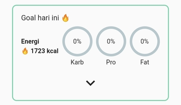
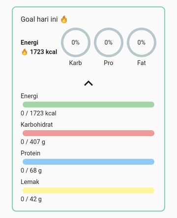
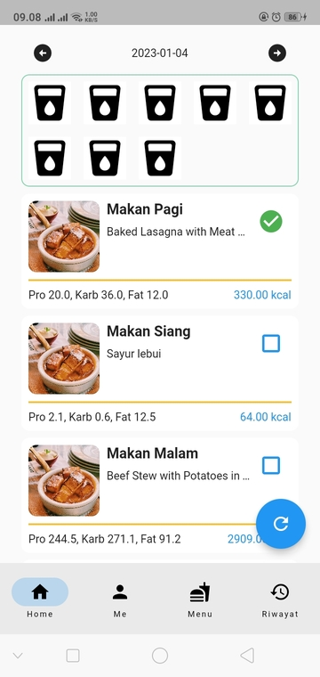

# Selamat datang di Meal Planner on Steroid

Meal Planner on Steroid atau MPS merupakan aplikasi yang membuat rekomendasi rencana diet secara otomatis dengan menggunakan ✨ **Algoritma Genetika** ✨ yang didasarkan dengan ✨ **Kebutuhan Gizi** ✨ yang anda miliki.

Tidak perlu hal rumit untuk membuat rencana diet, dengan satu tombol, kami akan memberikan rencana diet yang sesuai untuk anda.

---

## Mobile

### Install Aplikasi

Untuk memulai menggunakan MPS, anda perlu mengunduh aplikasi kami pada [!button variant="light" text="Play Store"](https://play.google.com/store/apps/details?id=io.github.alifirhas.mps)

Klik tombol [!button variant="success" text="Install"] dan tunggu proses instalasi dari Play Store selesai, kemudian klik [!button variant="success" text="Buka"]

---

### Quick Start

Untuk memudahkan penggunaan aplikasi kami, ini adalah langkah-langkah yang akan anda lalui untuk mendapatkan rekomendasi rencana diet berdasarkan kebutuhan gizi anda.

#### Login

Setelah anda membuka MPS, anda akan ditampilkan sebuah login, yang anda butuhkan adalah

1. Username
2. Password

Yang telah anda daftarkan di MPS.

Karena anda belum memiliki akun atau jika anda belum memiliki akun, maka anda perlu ke halaman register dengan menekan link [Belum punya akun? Daftar disini] yang berada di bagian bawah aplikasi dan menuju ke langkah [Register](readme.md#register).

Jika anda sudah memiliki akun makan anda bisa pergi ke langkah [Isi data diri](readme.md#isi-data-diri)

!!!
Saat ini **Google Login** masih belum bisa dilakukan dan kami minta maaf akan hal itu
!!!

---

#### Register

Anda akan ditampilkan sebuah form untuk melakukan registrasi ke MPS, dalam form ini anda akan mengisi data

1. First name / Nama depan
2. Last name / Nama belakang
3. Email
4. Username
5. Password

Email akan kami gunakan nantinya untuk proses penggantian password jika anda lupa password dari akun anda. Sedangkan username akan anda gunakan untuk [Login](readme.md#login)

<!-- Gambar register disini -->

Setelah anda mengisi seluruh form, klik [!button variant="success" text="DAFTAR"]

**Jika** anda telah memiliki akun, anda bisa kembali ke halaman login dengan menekan tombol kembali :icon-reply: pada smartphone anda atau menekan link [!button variant="contrast" text="Sudah punya akun? Klik disini"]

---

#### Isi data diri

Setiap anda Login, MPS akan menampilkan sebuah splash screen dan pada halaman terakhir anda akan mengisi data kesehatan anda yang terbaru. Anda tidak akan bisa mengakses aplikasi sebelum anda mengisi form tersebut. Dalam form ini anda akan mengisi

1. Berat badan (kg)
2. Tinggi badan (cm)
3. Usia (tahun)
4. Gender
5. Tingkat Aktivitas

Gender dan Tingkat Aktivitas merupakan pilihan ganda. Pilihan ganda dari Gender dan Tingkat Aktivitas adalah

||| Gender

- Laki-laki
- Perempuan

|||

||| Tingkat Aktivitas

- Sangat Ringan
- Ringan
- Sedang
- Berat

|||

Setelah anda sudah mengisi seluruh bagian form, silahkan klik [!button varian="success" text="Hitung Kebutuhan Gizi"]. Kemudian tombol [!button variant="light" text="Done"] akan bisa diklik dan akan mengantar anda ke [Halaman Utama](readme.md#halaman-utama)

---

#### Halaman Utama

Untuk memotong langkah, anda bisa langsung menuju ke langkah [Buat Rekomendasi Makanan](readme.md#buat-rekomendasi-makanan) dengan menekan tab [!button variant="light" icon="person-fill" text="Me"]

---

Pada halaman utama terdapat beberapa hal atau yang kami sebut element. Element ini adalah

==- Goal Hari Ini

Element ini berada di bagian atas halaman, element akan menampilkan

1. Kalori hari ini
2. Progress Karbohidrat
3. Progress Protein
4. Progress Lemak

Yang telah dimakan hari ini. Untuk melihat detail lebih banyak, anda bisa menekan tombol [!button variant="light" icon="chevron-down"]

Untuk menutup detail anda bisa menekan tombol [!button variant="light" icon="chevron-up"]

===

==- Rencana diet

Disini anda bisa melihat rencana diet yang direkomendasikan oleh MPS untuk anda setelah anda membuat rekomendasi menu makanan. Untuk melihat rencana diet kemarin anda bisa melakukan swipe atau mengusap ke sebelah kanan dan untuk melihat rencana diet besok anda bisa melakukan swipe atau mengusap ke sebelah kiri.

!!!
**Jika** terjadi loading yang terlalu lama, anda bisa menekan tombol refresh yang melayang di bagian bawah kanan
!!!

!!!
Saat ini **Catat progress minum** dan **Catat olahraga hari ini** masih belum bisa dilakukan dan kami minta maaf akan hal itu
!!!

===

---

#### Buat rekomendasi makanan

Untuk membuat rekomendasi makanan, anda perlu menuju ke halaman [Me](mobile/Halaman/Me/readme.md) dengan menekan tab [!button variant="light" icon="person-fill" text="Me"]

Pada halaman ini anda akan menekan tombol [!button variant="danger" text="Buat Rekomendasi Menu Makanan"]. Anda akan menunggu untuk beberapa saat selagi menunggu proses pembuatan rekomendasi menu untuk anda dilakukan. Setelah proses selesai anda akan menuju ke [langkah selanjutnya](readme.md#lihat-hasil) dan ditampilkan [Hasil Rekomendasi](mobile/Halaman/Me/buat_rekomendasi_menu_makanan_page.md#hasil-rekomendasi)

---

#### Lihat hasil

Pada halaman ini anda akan ditampilkan hasil rekomendasi menu yang akan anda gunakan untuk rencana diet. Di dalam halaman ini anda bisa melihat hasil rencana diet yang telah dibuat yang terdiri dari 3 menu makanan dan 2 camilan untuk 7 hari ke depan.

||| Hasil rekomendasi

||| Hasil rekomendasi detail hari

|||

Anda bisa menggunakan rekomendasi menu makanan dengan menekan tombol [!badge variant="success" text="berwarna hijau"]. Untuk membuat rekomendasi lagi anda bisa menekan tombol [!badge variant="warning" text="berwarna orange"]. Untuk membatalkan proses pemberian rekomendasi, anda bisa menekan tombol [!badge variant="danger" text="berwarna merah"].

---

#### Selebihnya

Untuk dokumentasi selengkapnya dari MPS, anda bisa mengunjungi [Dokumentasi Halaman](mobile/Halaman/readme.md) dan [Dokumentasi Fitur](mobile/Fitur/readme.md). Selamat menggunakan 😊.
